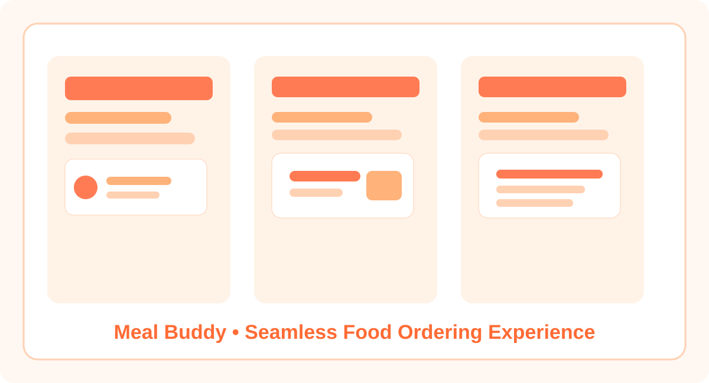
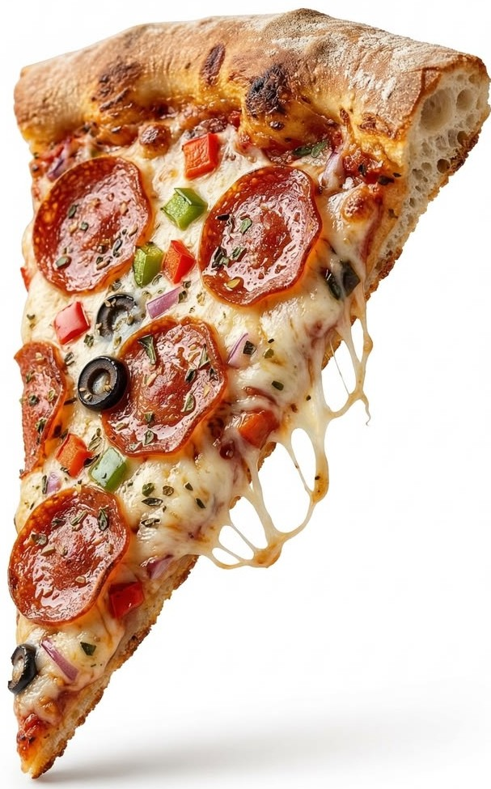
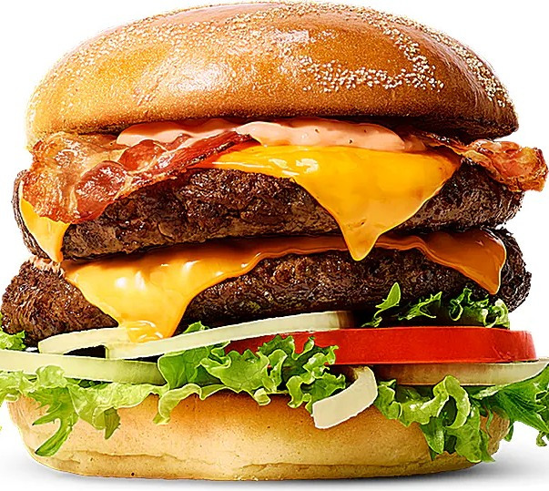
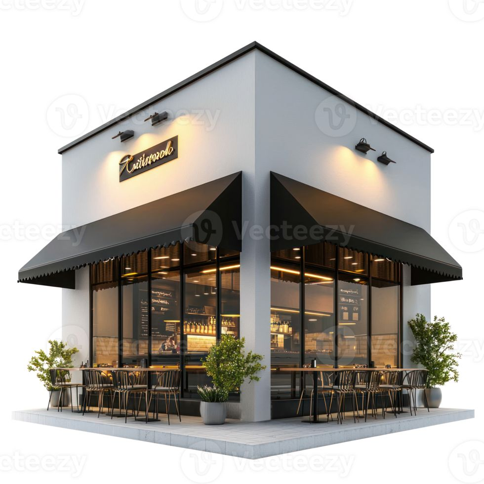

<p align="center">
  
</p>

# Meal Buddy

<p align="center">
  <a href="https://meal-buddy-2e80.onrender.com/"></a>
  
  
  
  
</p>

Meal Buddy is a full-stack food ordering and restaurant management web application built with Django. It provides a seamless experience for customers to browse restaurants, explore menus, add items to the cart, place orders, and complete payments, while enabling administrators to manage restaurants, menu items, users, and order workflows from a centralized dashboard.

This project demonstrates practical skills in backend development, database design, session management, role-based access control, payment integration, and cloud deployment. It is designed to be both functional and presentation-ready for recruiters and portfolio review.

## Live Demo

Explore the deployed application here:
- Render Demo: https://meal-buddy-2e80.onrender.com/

## Project Preview

<p align="center">
  
</p>

## Screenshots

<p align="center">
  
  
  
</p>

## Why This Project Stands Out

Meal Buddy goes beyond a basic CRUD application by combining multiple real-world features into one platform:

- End-to-end customer ordering experience
- Role-based access for customers and admins
- Dynamic cart and checkout flow
- Order management and payment handling
- Clean UI with reusable templates and structured frontend assets
- Deployment-ready configuration for production hosting

This makes it an excellent example of a practical, user-centric web application built with modern Python web development practices.

## Key Features

| Area | Highlights |
| --- | --- |
| Customer Experience | Signup/login, restaurant browsing, menu exploration, cart management |
| Ordering Flow | Checkout, order placement, payment handling, order tracking |
| Admin Control | Restaurant and menu management, user oversight, order monitoring |
| Technical Strength | Role-based access, session handling, reusable templates, deployment-ready setup |

### Customer Features
- User signup and login
- Restaurant discovery and menu browsing
- Add/remove items from cart
- Checkout and order placement
- Order history and status visibility
- Secure payment integration through Razorpay

### Admin Features
- Admin authentication and dashboard access
- Add, update, and remove restaurants
- Manage restaurant menu items
- View registered users
- Monitor and manage customer orders
- Track overall order and revenue insights

## Technology Stack

- Backend: Python, Django 6.0
- Database: SQLite for development and easy deployment
- Frontend: HTML, CSS, JavaScript, Django templates
- Payment Integration: Razorpay
- Static Files: WhiteNoise
- Hosting: Render
- Server: Gunicorn

## Project Structure

```text
meal-buddy/
├── delivery/                 # Main Django app
│   ├── templates/            # HTML templates for UI
│   ├── static/               # CSS, JS, and image assets
│   ├── models.py             # Database models
│   ├── views.py              # Application logic
│   ├── urls.py               # Route definitions
│   └── migrations/           # Database migrations
├── meal/                     # Project configuration
│   ├── settings.py           # Django settings
│   ├── urls.py               # Project-level URL config
│   └── wsgi.py               # WSGI entry point
├── manage.py                 # Django management script
├── requirements.txt          # Python dependencies
├── render.yaml               # Render deployment config
└── build.sh                  # Build script for deployment
```

## How the Application Works

```text
User → Sign In / Sign Up → Browse Restaurants → View Menu → Add to Cart → Checkout → Payment → Order Confirmation
                                            ↑
                                            │
                                    Admin Dashboard
                                    Manage Restaurants / Menu / Orders / Users
```

1. A user visits the landing page and chooses to sign up or log in.
2. The system identifies the user role as either customer or admin.
3. Customers can browse restaurants, view menus, add food items to the cart, and proceed to checkout.
4. Orders are processed and linked to the user account, with payment verification handled through Razorpay.
5. Admin users can manage application content and monitor orders from the admin dashboard.

This flow reflects a real-world food delivery platform structure, making the project suitable for demonstrating software engineering and product-thinking skills.

## Installation and Setup

### Prerequisites
- Python 3.10+
- pip
- virtual environment (recommended)

### Steps

```bash
git clone https://github.com/AkshathaHM/meal-buddy.git
cd meal-buddy
python -m venv .venv
source .venv/bin/activate   # On Windows: .venv\Scripts\activate
pip install -r requirements.txt
python manage.py migrate
python manage.py runserver
```

### Environment Variables
For local development, you can optionally set:

```bash
export DJANGO_DEBUG=True
export SECRET_KEY=your-secret-key
```

## Deployment

The project is configured for deployment on Render using the provided deployment files:
- render.yaml
- build.sh
- Procfile

This setup ensures that the application can be hosted and served efficiently in a production environment.

## Project Impact for Recruiters

Meal Buddy showcases the ability to build a complete, practical web application with:
- Full-stack Django development
- Database-driven application logic
- User authentication and authorization
- Payment integration
- Deployment and production-readiness

It is a strong portfolio project for roles such as:
- Python Developer
- Django Developer
- Backend Developer
- Full-Stack Developer
- Web Application Developer

## Author

Built with passion and a focus on practical software development by Akshatha H M.

## Connect

- GitHub: https://github.com/AkshathaHM
- Project Repository: https://github.com/AkshathaHM/meal-buddy
- Live Demo: https://meal-buddy-2e80.onrender.com/

---

<p align="center">
  <i>Thank you for exploring Meal Buddy.</i>
</p>
